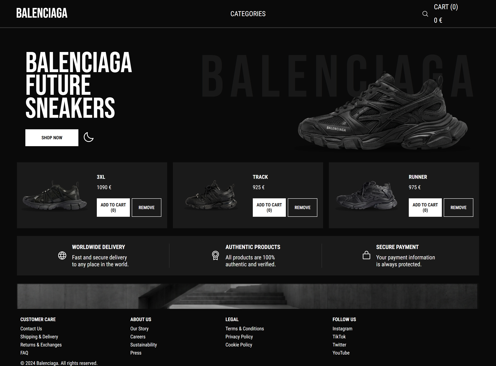

# Balenciaga Sneakers Marketplace (TypeScript)

Online sneaker store built with React and TypeScript. Connects to a REST API backend.

## Features
- 🛒 Add/remove items to cart (via API)
- 🔍 Search by product name
- 🌓 Dark/light theme
- 📱 Responsive design
- 📦 Full TypeScript typing

## Tech Stack
- React 18
- TypeScript
- CSS Modules
- Vite
- Phosphor Icons

## Backend
This frontend requires the [Balenciaga API](https://github.com/Kilkafk/balenciaga-server) to be running.

## Getting Started
1. Clone this repo
2. `npm install`
3. `npm run dev` (starts on `localhost:5173`)
4. Clone and run the [backend](https://github.com/Kilkafk/balenciaga-server) separately
